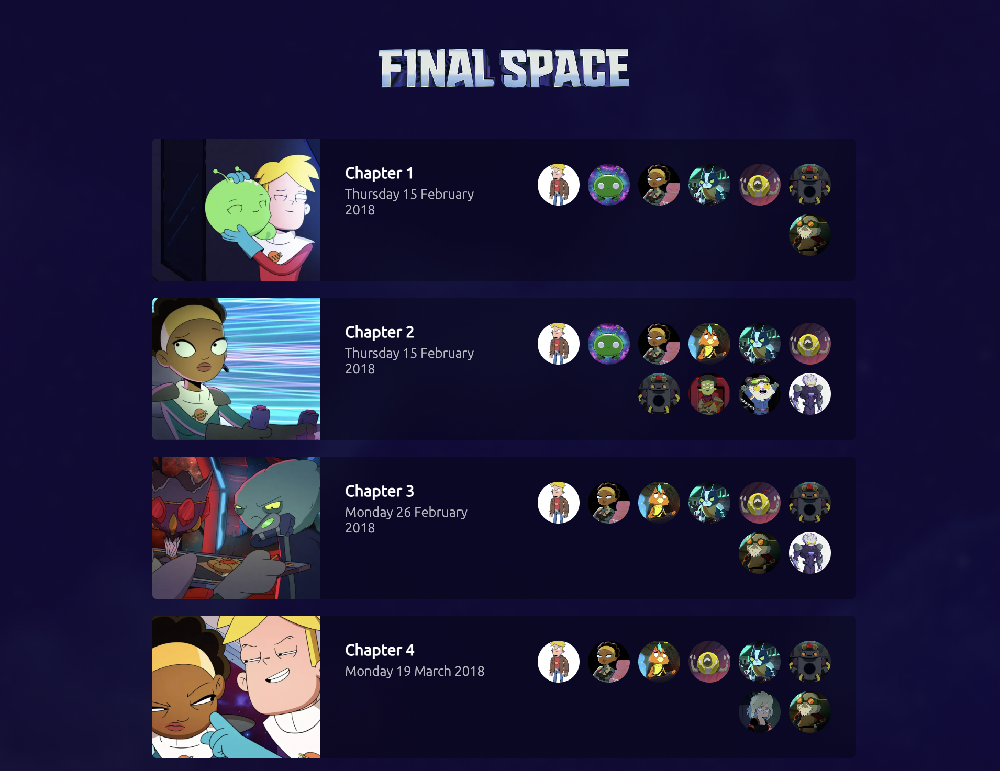

### Final Space episode episode list

> A React application that uses the [Final Space API](https://finalspaceapi.com/docs/) to display a list of episodes.



The application uses Next.js + TypeScript and Jest for unit tests.

I will keep the readme short but will be happy to argument process and tehcnical decisions by voice.

### Setup

```bash
git clone git@github.com:tancredi/fs-episodes-list.git
cd tancredi/fs-episodes-list
npm install
npm run dev
open http://localhost:3000
```
